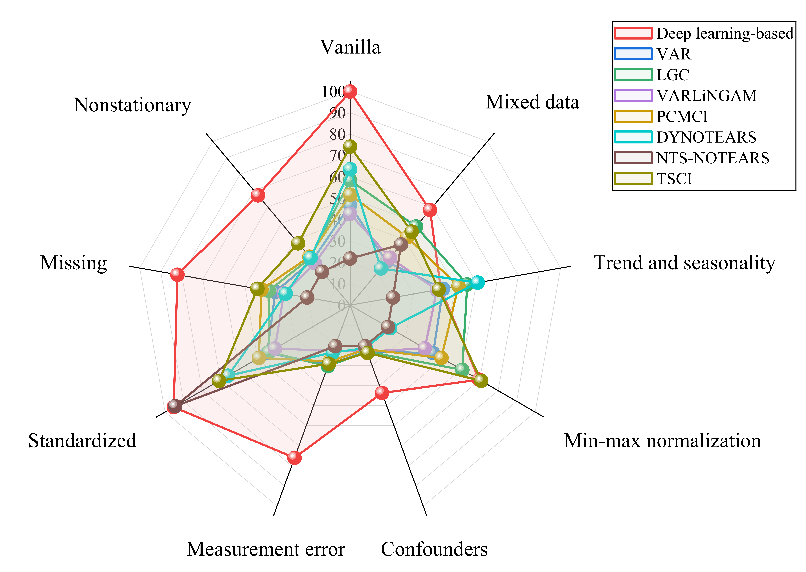

.. |arXiv| image:: https://img.shields.io/badge/arXiv-2602.07915-b31b1b.svg
   :target: https://arxiv.org/abs/2602.07915

.. |Documentation| image:: https://img.shields.io/badge/View-Documentation-blue
   :target: https://causalegm.readthedocs.io/en/latest/index.html

.. |PyPI| image:: https://img.shields.io/pypi/v/causalchamber
   :target: https://pypi.org/project/causalchamber/

.. |License| image:: https://img.shields.io/badge/License-MIT-yellow.svg
   :target: https://github.com/huiyang-yi/CausalCompass/blob/main/LICENSE

|arXiv| |Documentation| |PyPI| |License|

==============
CausalCompass
==============

**CausalCompass** is a Python package that provides a flexible and extensible benchmark suite for evaluating the robustness of **time-series causal discovery (TSCD)** methods under **misspecified modeling assumptions**. For more details, please refer to the `Document <https://causalegm.readthedocs.io/>`_.

Abstract
^^^^^^^^

Causal discovery from time series is a fundamental task in machine learning. However, its widespread adoption is hindered by a reliance on untestable causal assumptions and by the lack of robustness-oriented evaluation in existing benchmarks. To address these challenges, we propose **CausalCompass**, a flexible and extensible benchmark suite designed to assess the robustness of time-series causal discovery (TSCD) methods under violations of modeling assumptions. To demonstrate the practical utility of CausalCompass, we conduct extensive benchmarking of representative TSCD algorithms across eight assumption-violation scenarios. Our experimental results indicate that no single method consistently attains optimal performance across all settings. Nevertheless, the methods exhibiting superior overall performance across diverse scenarios are almost invariably deep learning-based approaches. We further provide hyperparameter sensitivity analyses to deepen the understanding of these findings. We also find, somewhat surprisingly, that NTS-NOTEARS relies heavily on standardized preprocessing in practice, performing poorly in the vanilla setting but exhibiting strong performance after standardization. Finally, our work aims to provide a comprehensive and systematic evaluation of TSCD methods under assumption violations, thereby facilitating their broader adoption in real-world applications.

Key Features
^^^^^^^^^^^^

* **8 assumption-violation scenarios**: Confounders, nonstationarity, measurement error, standardization, missing data, mixed data, min-max normalization, and trend/seasonality
* **2 vanilla models**: VAR (linear) and Lorenz-96 (nonlinear)
* **11 TSCD algorithms spanning 6 major methodological categories**:

  * **Granger causality-based**: VAR, LGC
  * **Constraint-based**: PCMCI
  * **Noise-based**: VARLiNGAM
  * **Score-based**: DYNOTEARS, NTS-NOTEARS
  * **Topology-based**: TSCI
  * **Deep learning-based**: cMLP, cLSTM, CUTS, CUTS+

Datasets
^^^^^^^^

The ``datasets/`` directory contains sample datasets. Complete datasets can be generated using the provided scripts. For convenience and reproducibility, the complete datasets archive is publicly available at
`Google Drive <https://drive.google.com/file/d/1jpggkKcT6cBc4YQT5bQYPj68pD4ImOj3/view?usp=sharing>`_.

The generated datasets follow the naming convention::

   [scenario]_[params]_[model]_p[p]_T[T]_[optional]_seed[seed].npz

Example: ``confounder_rho0.5_VAR_p10_T1000_seed0.npz``

Citation
^^^^^^^^

If you use this code or datasets in your research, please cite:

.. code-block:: bibtex

   @misc{yi2026causalcompass,
     title   = {{CausalCompass}: Evaluating the Robustness of Time-Series Causal Discovery in Misspecified Scenarios},
     author  = {Yi, Huiyang and Shen, Xiaojian and Wu, Yonggang and Chen, Duxin and Wang, He and Yu, Wenwu},
     year    = {2026},
     note    = {Under review as a conference paper}
   }

License
^^^^^^^

* The code in this repository is released under the `MIT License <./LICENSE>`_.
* The datasets generated and provided by this repository are released under the `CC BY 4.0 License <./LICENSE-CC-BY-4.0>`_.

Contributing
^^^^^^^^^^^^

Contributions are welcome! If you encounter bugs, have suggestions for improvements, or would like to extend CausalCompass with additional assumption-violation scenarios or evaluation protocols, please feel free to open an issue or submit a pull request. 

Contact
^^^^^^^

For questions or issues, please:

* Open an issue in this repository
* Email: yihuiyang@seu.edu.cn

.. toctree::
   :maxdepth: 1
   :caption: MAIN
   :hidden:

   about
   installation
   usage
   api

.. .. toctree::
..    :maxdepth: 2
..    :caption: API Reference

..    api/causalcompass