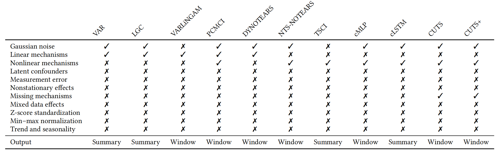
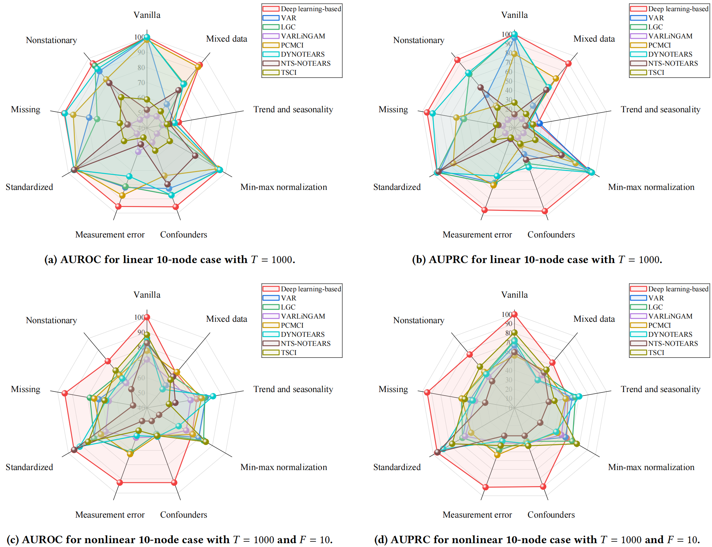
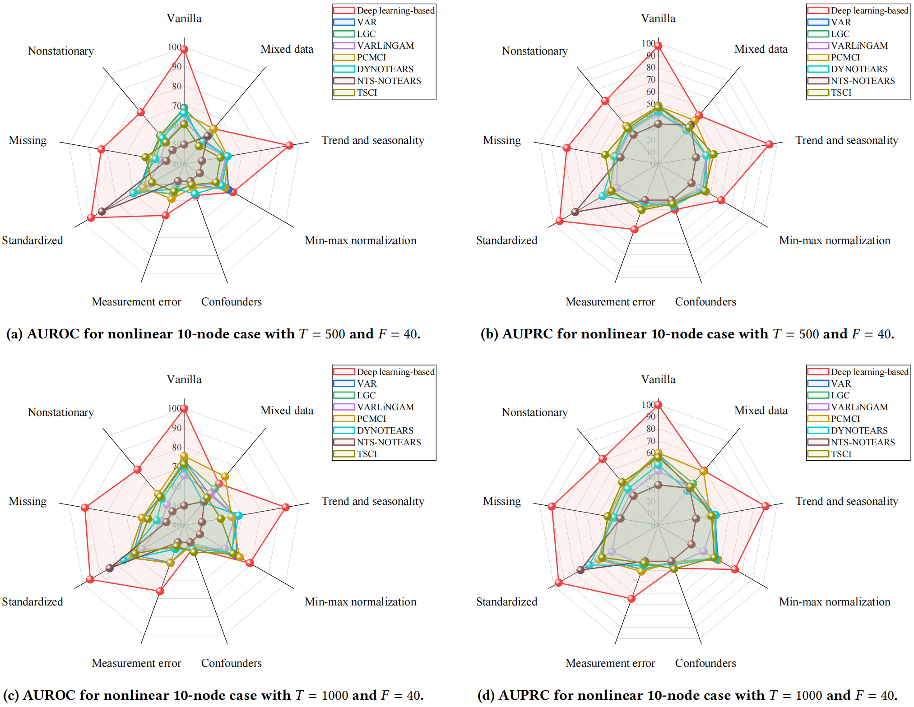
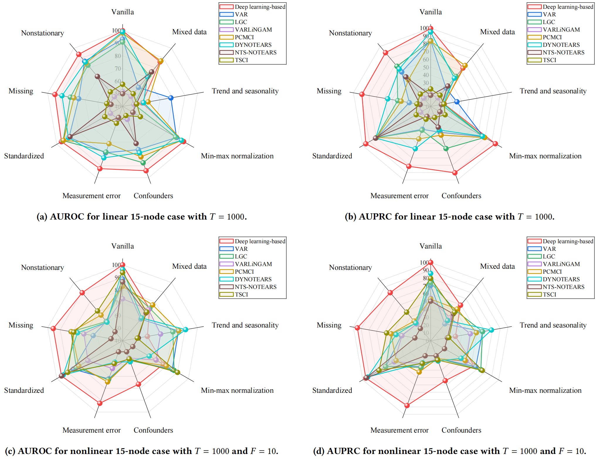
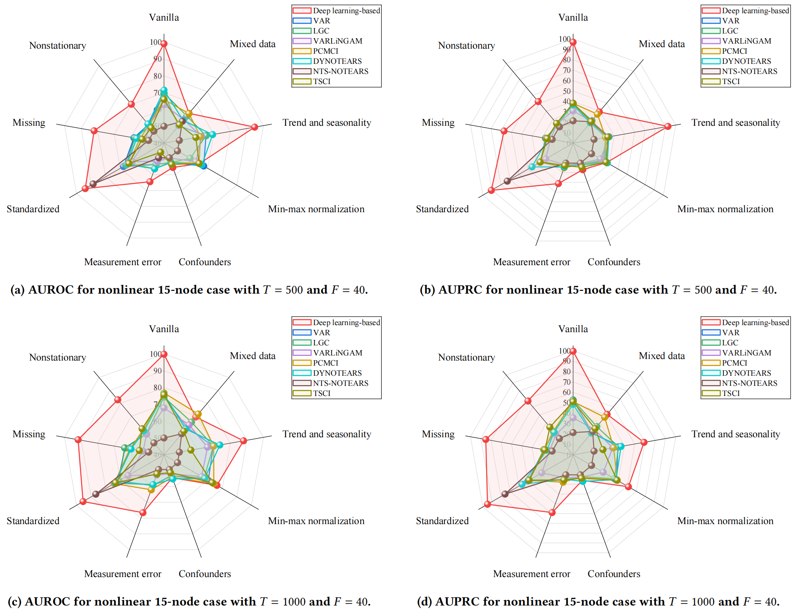
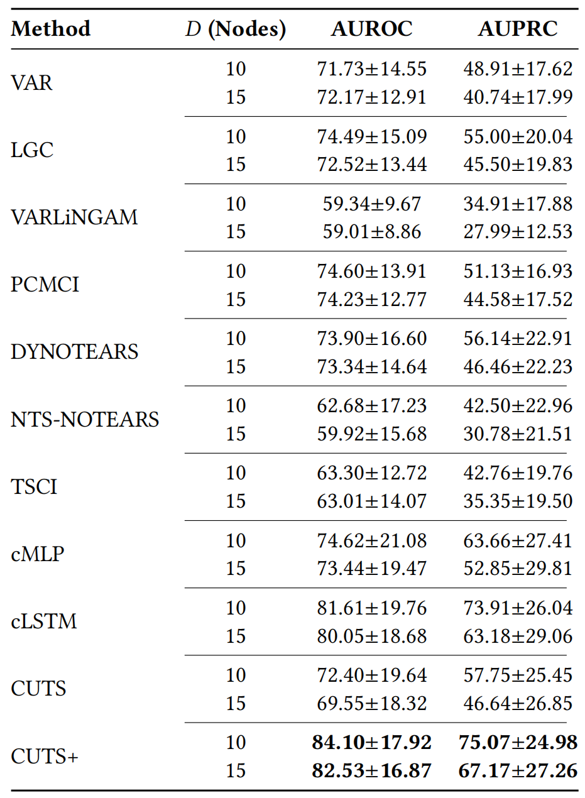

# CausalCompass: Evaluating the Robustness of Time-Series Causal Discovery in Misspecified Scenarios

<p align="center">
Huiyang Yi<sup>1</sup>, Xiaojian Shen<sup>2</sup>, Yonggang Wu<sup>1</sup>, Duxin Chen<sup>1,†</sup>, He Wang<sup>1</sup>, Wenwu Yu<sup>1</sup>
</p>

<p align="center">
<sup>1</sup>Southeast University &nbsp;&nbsp; <sup>2</sup>Jilin University &nbsp;&nbsp; <sup>†</sup>Corresponding Author
</p>

---

## Abstract

Causal discovery from time series is a fundamental task in machine learning. However, its widespread adoption is hindered by a reliance on untestable causal assumptions and by the lack of robustness-oriented evaluation in existing benchmarks. To address these challenges, we propose **CausalCompass**, a flexible and extensible benchmark suite designed to assess the robustness of time-series causal discovery (TSCD) methods under violations of modeling assumptions. To demonstrate the practical utility of CausalCompass, we conduct extensive benchmarking of representative TSCD algorithms across eight assumption-violation scenarios. Our experimental results indicate that no single method consistently attains optimal performance across all settings. Nevertheless, the methods exhibiting superior overall performance across diverse scenarios are almost invariably deep learning-based approaches. We further provide hyperparameter sensitivity analyses to deepen the understanding of these findings. We also find, somewhat surprisingly, that NTS-NOTEARS relies heavily on standardized preprocessing in practice, performing poorly in the vanilla setting but exhibiting strong performance after standardization. Finally, our work aims to provide a comprehensive and systematic evaluation of TSCD methods under assumption violations, thereby facilitating their broader adoption in real-world applications.

## Overview

Table 1: Summary of the assumptions associated with each algorithm and the types of causal graphs they are designed to recover. Each cell indicates whether an algorithm explicitly supports (✓) or does not support (✗) the specific condition listed in the corresponding row. "Summary" and "window" refer to the summary causal graph and the window causal graph, respectively.



## Experimental Results



Figure 1: Experimental results under the linear and nonlinear settings across the vanilla scenario and eight assumption violation scenarios. AUROC and AUPRC (the higher the better) are evaluated over 5 trials for the 10-node case with *T* = 1000. For the deep learning-based methods, we present only the optimal results.




Figure 3: Experimental results under the nonlinear settings across the vanilla scenario and eight assumption violation scenarios. AUROC and AUPRC (the higher the better) are evaluated over 5 trials for the 10-node case with *F* = 40. For the deep learning-based methods, we present only the optimal results.




Figure 5: Experimental results under the linear and nonlinear settings across the vanilla scenario and eight assumption violation scenarios. AUROC and AUPRC (the higher the better) are evaluated over 5 trials for the 15-node case with *T* = 1000. For the deep learning-based methods, we present only the optimal results.




Figure 6: Experimental results under the nonlinear settings across the vanilla scenario and eight assumption violation scenarios. AUROC and AUPRC (the higher the better) are evaluated over 5 trials for the 15-node case with *F* = 40. For the deep learning-based methods, we present only the optimal results.


Table 3: Summary of methods' performances across all scenarios and configurations. The reported results are the mean and standard deviation of the metrics across different time series lengths, external forcing intensities, vanilla scenarios and misspecified scenarios.




---

## Citation

If you use this code or datasets in your research, please cite:

```bibtex
@misc{yi2026causalcompass,
  title   = {{CausalCompass}}: Evaluating the Robustness of Time-Series Causal Discovery in Misspecified Scenarios},
  author  = {Yi, Huiyang and Shen, Xiaojian and Wu, Yonggang and Chen, Duxin and Wang, He and Yu, Wenwu},
  year    = {2026},
  note    = {Under review as a conference paper}
}
```

---

**Note:** The final bibliographic information (e.g., venue and proceedings details) will be updated upon paper acceptance.
